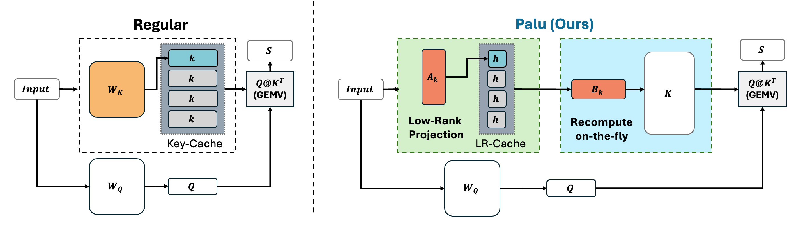

# Palu: Compression KV-Cahce with Low-Rank Decomposition
[[Paper](https://arxiv.org/abs/2407.21118)]

<div align='center'>
 
</div>

## Updates
- [2024.11.03]: We updated our [arXiv](https://arxiv.org/pdf/2407.21118) with latency evaluation on quantization integration. Check it out!
- [2024.08.01]:🚀 Palu ver. 1 is released.

## TL;DR
Palu is a KV-Cache compression framework that utilizes low-rank projection to compress the hidden dimension of KV-Cache, thereby reducing memory footprint and increasing speed.

## Abstract
Palu is a pioneer KV-Cache compression framework that reduce the hidden dimenssion of KV-Cache via low-rank projection.
Different from [MLA in DeepSeek-V2](https://arxiv.org/abs/2405.04434) that requires a large-scale training from scratch, Palu works with existing LLMs such as Llama3, Mistral, in a post-training manner.
To achieve this, Palu decomposes the linear layers into low-rank matrices, caches the smaller intermediate states, and reconstructs the full keys and values on the fly. To improve accuracy, compression rate, and efficiency, Palu further encompasses (1) a medium-grained low-rank decomposition scheme, (2) an efficient rank search algorithm, (3) matrix fusion for quantization friendliness enhancements, and (4) co-designed GPU kernels. 

Our extensive experiments with popular LLMs show that Palu can compress KV-Cache by more than 91.25% while maintaining a significantly better accuracy (up to 1.19 lower perplexity) than state-of-the-art KV-Cache quantization methods at a similar or even higher memory usage. For more details, please refer to our [paper](https://arxiv.org/abs/2407.21118).

## Todo Lists
- [ ] Upgrade `transformers>=4.43.3`, for Llama3.1 support
- [ ] Update reconstruction kernel, with quantization integrated.
- [ ] Support FlashAttention or FlashInfer to enhance competatiblity
  

## Installation
1. Clone the repository (Make sure you have Git, Conda installed on your system)
```
git clone --recurse-submodules https://github.com/shadowpa0327/Palu.git
cd Palu
```

2. Prepare environment
```
conda create -n Palu python=3.10
conda activate Palu
pip install -r requirements.txt
```

3. Install 3rdparty libraries
```
pip install -e 3rdparty/lm-evaluation-harness
pip install -e 3rdparty/fast-hadamard-transform
```

## Usage
### Rank Search and Compression
We provide a script `compress.py` to perform the rank search and low-rank decomposition to generate the low-rank projection matrices for compressing KV-Cache. Here, we perform the decomposition with proposed `G-LRD` methods with group size equal to 4 as an example. 
```bash
python compress.py \
--model_id=/Path/To/Pretrained/Model \
--calib_dataset wikitext2 \
--param_ratio_target 0.7 \
--search_method fisher_uniform \
--head_group_size 4 \
--dump_huggingface_model \
--use_cache 
```

After executing the above command, a compressed models with decomposed low-rank projection matrices will be dumped into the `{MODEL_NAME}-ratio-{TARGET_RATIO}_gs-{GROUP_SIZE}-{SEARCH_METHOD}-{DECOMPOSE_METHODS}` directory. Here, the dumped models is stored via the huggingface transformers format. 

### Evaluation
With the compressed model dumped, we can evaluate the performance of the compressed model on the various tasks. We provide the scripts for evaluating the perplexity, zero-shot evaluation, and LongBench. By default, we will keep the compressed KV-Cache in fp16.

#### Perplexity
To evaluate the perplexity of the compressed model on the `wikitext2` dataset with sequence length 2048, we can use the `ppl_eval.py` script.
```bash
python run_ppl_eval.py \
--model_name_or_path /Path/To/Palu/Model \
--datasets wikitext2 \
--seqlen 2048
```
To reproduce the evalaution of `c4` perplexity, simply change the `datasets` argument to `c4`. 

To evaluate the performance of quantization being integrated, please pass `--lt_bit {num_bits}` and `--lr_haramard` in the arguments to enable our low-rank aware quantization.
For example, to evaluate the Palu with 3-bit low-rank aware quantization, please run:
```bash
python run_ppl_eval.py \
--model_name_or_path /Path/To/Palu/Model \
--datasets wikitext2 \
--seqlen 4096 \
--lt_bits 3 \
--lt_hadamard 
```

*Note*: `run_ppl_eval.py` does not support multi-gpu evaluation. If your machine has multiple GPUs, please set `CUDA_VISIBLE_DEVICES` to the desired GPU id.

#### Zero-shot Evaluation
To run zero-shot evaluations, please use the `run_lm_eval.py` script, which implements a wrapper around the [lm-evaluation-harness](https://github.com/EleutherAI/lm-evaluation-harness/tree/big-refactor) library. 

Before we start, please make sure the `lm-eval==0.4.2` library is installed.

To reproduce the results in our paper, simply execute:
```bash 
CUDA_VISIBLE_DEVICES=0 python run_lm_eval.py --model_name_or_path /Path/To/Palu/Model \
--tasks "openbookqa,hellaswag,piqa,arc_easy,arc_challenge,winogrande"
```

#### Long-Bench

We also provide a script to run the long-bench evaluation on the compressed model. 
```bash
CUDA_VISIBLE_DEVICES=0 python run_long_bench.py \
--model_name_or_path /Path/To/Palu/Model
```
The scrips will evaluate on "triviaqa", "qasper", "trec", "samsum", "lcc", "repobench-p", "qmsum" and "multi_news" datasets by default.
User may also leverage the `--datasets` argument to specify the tasks to evaluate. For example, add `--datasets "triviaqa,qasper"` to evaluate on "triviaqa" and "qasper" datasets only.


### Latency Evaluation

#### Attention Module
We provide a script to evaluate the compressed attention module latency under different settings. Below is an example demonstrating how to use this script to evaluate the latency of Palu attention module.

```bash
CUDA_VISIBLE_DEVICES=0 python run_latency_attention.py \
    --rank_k 1024 --rank_v 3072 --group_size 4 \
    --prompt_len 65536 --palu
```

The above command will run the latency evaluation with the following arguments:
- `--rank_k`: Set the rank of the key matrix.
- `--rank_v`: Set the rank of the value matrix.
- `--group_size`: Set the group size, which is used in the low-rank decomposition.
- `--prompt_len`: Set the prompt length.
- `--palu`: Enable Palu compression technique.

#### Reconstruction Kernel
We also provide a script to evaluate our reconstruction kernel latency. Below is an example demonstrating how to use this script to evaluate the latency of Palu reconstruction kernel.

```bash
CUDA_VISIBLE_DEVICES=0 python run_latency_kernel.py \
    --total_rank 1024  --group_size 4
```

## Reference
If you find this work useful, please consider citing our paper:
```
@misc{chang2024palucompressingkvcachelowrank,
      title={Palu: Compressing KV-Cache with Low-Rank Projection}, 
      author={Chi-Chih Chang and Wei-Cheng Lin and Chien-Yu Lin and Chong-Yan Chen and Yu-Fang Hu and Pei-Shuo Wang and Ning-Chi Huang and Luis Ceze and Kai-Chiang Wu},
      year={2024},
      eprint={2407.21118},
      archivePrefix={arXiv},
      primaryClass={cs.AI},
      url={https://arxiv.org/abs/2407.21118}, 
}
```
